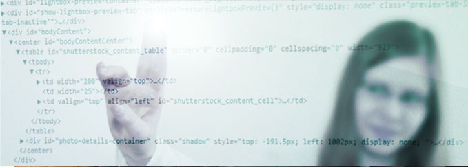
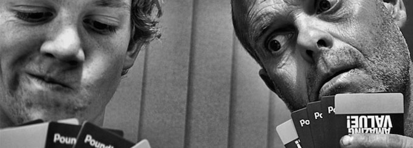

# Hello-People-Of-The-Internet

Hello People Of the Internet This Is My Repository And I Hope You Enjoy It As Much As I Do
 
CAuTiOn ThIs Is NoT fOr ThE DaRk WeB
 
 [People Of Intrest](https://github.com/juareisa000/Hello-People-Of-The-Internet/blob/master/peopleofintrest.md)

###### Course: §126.33

## Web Design

TechApps in Texas has six main strands based on the National Education Technology Standards and performance indicators based on the International Society for Technology in Education;  creativity and innovation; communication and collaboration; research and information fluency; critical thinking, problem solving, and decision making; digital citizenship; and technology operations and concepts. These are found across the different Tech Apps courses in Texas, including Computer Science.

Our Web Design course is designed to be an introduction into the fundamentals of the origins of Web Design and where it is today. Web Design offers students a more gentle introduction into a skillset including professional software and coding. Students will work with three different computer languages in Web Design; HTML, CSS, and JavaScript. It would be great to include more, as this alone isn't enough in the industry today, but it's better to understand the basics well, than to go through everything quickly and not be able to use any of it. No background in specialized software is required.

Web Design is an intermediate-level course, not introductory level. Prior to taking Web Design, it is recommended for students to complete Fundamentals of CS or Digital Communications. Students may also consider taking Digital Art to increase general knowledge of graphic software.

 
#### Course Summary

Web Design is a more gentle introduction into creating products directly with code, but that doesn't mean the course won't be challenging. While the web is overall still a pretty young field of study, due to the wide range of variables impacting the field, there has been significant change in the field over the past 25 years. The content is not technically difficult, but it does require thinking and solving problems in a way different from majority of the American education system. The 'best' way to do things in the past, is not the 'best' way now; the 'best' way now is not future-proof.

#### As an IB Continuum School

As an IB Continuum School, how we meet the expectations required by the state of Texas may look differently than what you'd see at other schools. The expectations set by Texas rarely match the significantly greater expectations of planning and evaluating found in IB. As such, many educational institutions in Texas expect very little planning and evaluation in their students work, instead often focusing on being able to recall a large amount of content. The International Baccalaureate has a greater focus on planning and evaluating, as well as on application of content instead of recall- especially in the design courses. 

The MYP technology and design courses develop skills linked to the design cycle, which provides the model of thinking and the strategy used to help students investigate problems and design, plan, create and evaluate the product. This is less of an issue in Tech Apps content in Texas, as the newer redefined expectations released in 2012 due reflect greater planning than previous expectations. To what extent and level of focus schools apply to this specific subset of Texas standards will vary, and will mostly likely be less at non-IB campuses.
 
Due to the structure IB expects, our courses tend 'cover' less content, instead choosing to focus on deeper more meaningful interaction between students and content. In the long run, students are better prepared for higher level work, instruction, and the real world. They tend to retain more as well, as they usually actually remember the content due to the significantly deeper understanding of use of content, instead of shallow memorization.
 
#### Lab Hours

Lab hours available for extra time or additional help. If you need guidance, please schedule an appointment. If you just need extra work time, pop-ins are allowed. If you choose not to work in class and are a distraction to others, and then ask to come in for extra time, you will likely be denied extra time. You should make use of the time you already have in scheduled class before requesting more.

Before School: Tuesday - Thursday
* 7:15 - 7:45 am

Lunch: A Days Only
* 12:55 - 1:30 pm

After School: Monday, Tuesday, & Thursday
* 3:15 - 4:00 pm

If you need other accommodations, please see your instructor to make an appointment.

#### Web Design Course Content
 
The content in this course will build on itself. If you don't intend to remember the concepts and basic code throughout the year, you will struggle as future content will make use of previously used content to reinforce and increase the complexity of what you can create. If this is a field you are interested in, this is just a start into the study of it. You will need further study, but this is a good start and will give you a good foundation to build on.
 
This course will require use of coding, Photoshop, and design principles. If you are interested in coding almost exclusively, you might consider taking Computer Science in addition to Web Design. If you are concerned about becoming familiar with design principles and/or Photoshop while learning to code, consider taking Digital Design and/or Digital Art while enrolled in, or prior to enrolling in, Web Design.

Our Web Design course spans across 2 semesters. The course is broken up into 2 massive units.

**Fall Unit: Brutalist Design**
* Origins of the Web
* Basic HTML
* Designing for low-bandwidth
* Basic PHP
* Simulating 90's Tech Capabilities
* Design Patterns of the 90s

**Spring Unit: Modern Web Design**
* CSS
* Javascript
* Modern Design Patterns 

For the traditional American education system, this is an elective. An elective does not mean you get a free A. An elective actually means you don't have to pass. You can excel in, barely pass, or fail this class. Which ever result you choose to pursue will be on your transcript, will affect your GPA, and will be included in what is sent to colleges and universities.
 
To IB, this subject area is just as important as any other, and should require rigorous and significant course work. You are expected to put forth a valiant effort consistently during class and throughout the year. The grade is a reflection of your choices; good or bad.

##### A bit of reading material:
- [Why all Graphic Design Students Should Learn Web Design](www.loudnoises.us/the-noise/why-all-graphic-design-students-should-learn-web-design-and-10-other-things-you-outta-know/)
 
#### Style of Instruction:
Majority of content will be delivered through video instruction. This allows you to revisit content as often as you need, as well as to be able to slow down, speed up, or repeat content as often as you need. This also allows your instructor to work with and help students or groups of students when they need, without stopping the content for the rest of students.
 
As you are able to work at your own pace, this can sometimes cause a general slowdown for some students. Despite being able to watch videos whenever you need, it is important that you keep up with the pace of the course to not end up with a ton of backwork to complete at the midterm or at term's end.

#### Cheating & Academic Dishonesty 

##### Copyright & Intellectual Property:

All forms of academic dishonesty and cheating are taken seriously. Some forms of cheating and academic dishonesty are more self-explanatory than others. When it comes to art, many students struggle with understanding intellectual property. As such, it is generally recommended to avoid using copyrighted materials without first discussing it with your instructor.
 
Many students are under the belief that if it is for education, copyright and intellectual property laws don't apply. This is not the case. Many companies choose not to file charges when copyright or intellectual property laws are violated for educational use, but some companies do, and this doesn't mean they can't choose to at a later point in time. Use of other's works as your own, without proper documentation can result in loss of credit. However, use of copyrighted material can also result in legal issues in addition to any academic woes.
  
##### A bit of reading material:
-[Copyright Crash Course](http://guides.lib.utexas.edu/copyright)

-[10 Big Myths About Copyright Explained](https://www.templetons.com/brad/copymyths.html)

##### Collaboration vs Collusion:

All forms of academic dishonesty and cheating are taken seriously. Some forms of cheating and academic dishonesty are more self-explanatory than others. The form of academic dishonesty that seems to confuse students is collusion. Collusion is providing or receiving unauthorized aid or assistance. What is or isn't authorized can vary from course to course, so it is important that you communicate with, and understand the expectations of, your instructor.
 
Research, as well as personal experience, shows that students tend to understand content better when working with and discussing content with other students. Some assignments will actually require it. However, it is important that the aid and assistance you receive, or that you provide, is authorized. If you are physically touching another student's keyboard, mouse, or sending complete or partial chunks of code, you are likely engaging in collusion, not collaboration. If unsure, it's better to ask. Collusion is a form of academic dishonesty and can result in loss of credit for all parties involved.
  
##### A bit of reading material:
-[Crossing the Line: Collusion or Collaboration...](https://files.eric.ed.gov/fulltext/EJ1004398.pdf)

-[Robert College's Collaboration Guidelines](http://webportal.robcol.k12.tr/Academics/Academic-Honesty/CollaborationGuidelines/Pages/default.aspx)
 
#### CMS / LMS:
We will use ManageBac.

# Syllabus
###### for IB MYP US courses with S. Wegscheid

Majority of my Design and Tech courses at WAIS are designed with regards to IB MYP and CP. Courses also fulfill Texas STEM or Business & Industry graduation endorsements if part of a coherent sequence.

| STEM                             | B & I                       | 
| -------------------------------- | --------------------------- |
| * Fundamentals of CS             | * Digital Art & Animation¹  |
| * Computer Science               | * Dig. Communications       |
| * Computer Science 2             | * Dig. Design & Media Prod. |
| * Computer Science 3             | * Dig. Video & Audio Design |
| * Computer Science Diploma-Level | * Ind. Study in Emerg. Tech |
| * Ind. Study in Tech Apps        | * Web Design                |
| * Robotics Prg. & Design         |                             |

Not all classes are available every year. The courses taught are based on the interest level shown on course selection sheets.

¹ Satisfies Fine Art Graduation Requirement

 I understand

### Classroom Expectations:
The Balcony Mac Lab is a district computer lab, and as such has some policies that are set by the district.

By the district, food and drink are not allowed. This includes candy and gum. Students may have a water bottle, but it needs to be resealable, and kept on the floor.

Every student is sitting at a new iMac with 16 gb of ram and a 21.5” screen. As such, students do not need and should not be using any additional devices without permission. This includes but is not limited to phones, tablets, and chrome books.

Specific homework is rarely given. As such, students are expected to be productive from the start of class, until the end. However, you are expected to interact with course content or concepts outside of class.

 I understand

### For class, please consider bringing:
* Headphones (your personal use)
* Jacket/Sweater (if you get cold easy)

Please consider bringing some form of supplies for general class use, such as:
* Kleenex
* Graph Paper
* Printer Paper

 I understand

### Course Content:
Students will work with professional software and languages in design and tech courses. The specific software will vary depending on the course.

When turning in work, use font in a responsible readable manner; around sizes 10-12, good contrast in colors, respectable serif or san serif fonts like Avenir, Helvetica, Georgia, Palatino, Times, etc. Any work in Comic Sans, Papyrus, Curlz, or other overly decorative fonts will not be scored. A document should not have more than 2 or 3 fonts. If variety is needed, make use weight, sizes, and styles within the same font instead of hopping from font to font.

 I understand

### Major Reports and Projects:
Courses will have documentation accompanying long term project work. These projects and documents are due at the end of each semester, and students will work on different parts of them throughout the course.

This is aligned and modeled from industry and is aligned with IB Design expectations.

 I understand

### Grading:
Design and Tech places a higher grade percentages on what you do everyday, as opposed to on just a single day when you might have a test or project due.

| %                 | Category                            | 
| ------------------| ----------------------------------- |
| 50%               | * Daily / Activities                |
| 30%               | * Projects / Tests                  |
| 20%               | * Homework / Quizzes / Out of Class |

If there is a question regarding grades in any of your classes, please speak to your teacher sooner than later. There are limitations to when changes can be made. If a grade should be changed, and it isn't because you chose not to talk to me about it, it won't be changed.

 I understand

### Cheating & Academic Dishonesty
##### Copyright & Intellectual Property:
All forms of academic dishonesty and cheating are taken seriously. Some forms of cheating and academic dishonesty are more self-explanatory than others. When it comes to art, many students struggle with understanding intellectual property. As such, it is generally recommended to avoid using copyrighted materials without first discussing it with your instructor.
 
Many students are under the belief that if it is for education, copyright and intellectual property laws don't apply. This is not the case. Many companies choose not to file charges when copyright or intellectual property laws are violated for educational use; some companies do, and this doesn't mean they can't choose to at a later point in time. Use of others' works within your own work, without proper documentation can result in loss of credit. However, use of copyrighted material can also result in legal issues in addition to any academic woes.

 I understand

##### Collaboration vs Collusion:
All forms of academic dishonesty and cheating are taken seriously. Some forms of cheating and academic dishonesty are more self-explanatory than others. The form of academic dishonesty that seems to confuse students is collusion. Collusion is providing or receiving unauthorized aid or assistance. What is or isn't authorized can vary from course to course, so it is important that you communicate with, and understand the expectations of, your instructor.
 
Research, as well as personal experience, shows that students tend to understand content better when working with and discussing content with other students. Some assignments will actually require it. However, it is important that the aid and assistance you receive, or that you provide, is authorized. If you are physically touching another student's keyboard, mouse, or sending complete or partial chunks of an assignment, you are likely engaging in collusion, not collaboration. If unsure, it's better to ask. Collusion is a form of academic dishonesty and can result in loss of credit for all parties involved.

 I understand
